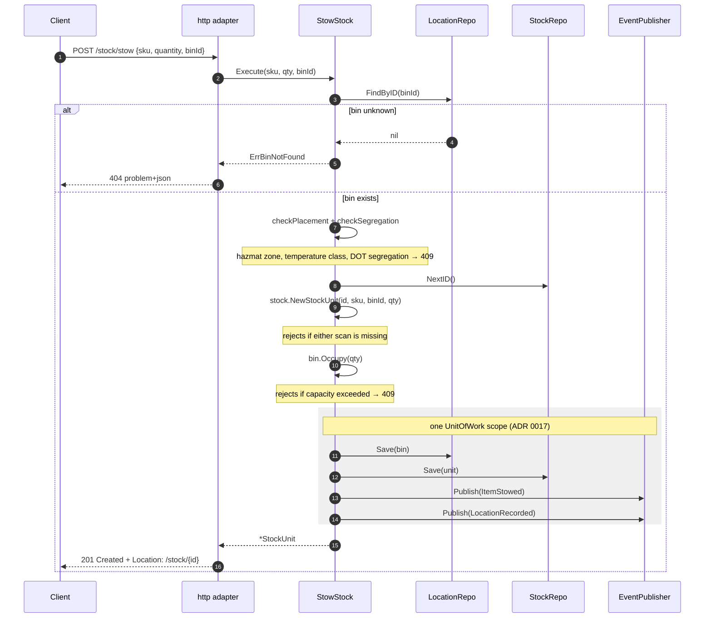
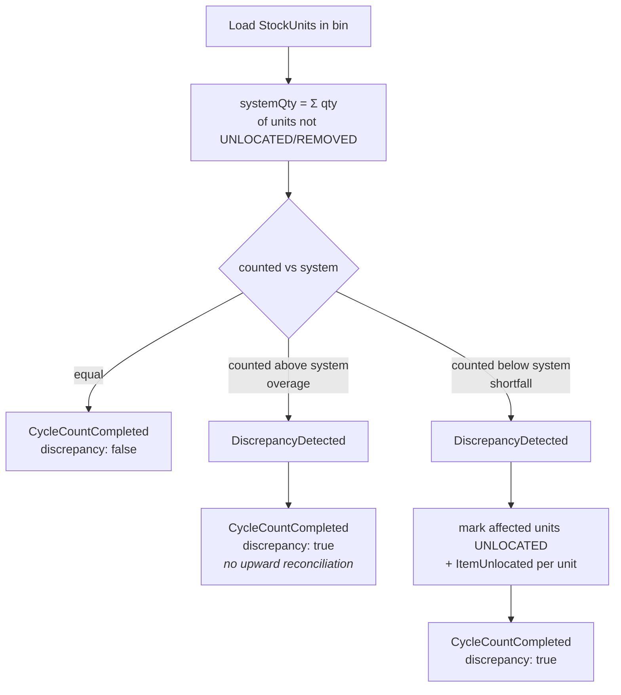

# Use Cases

Twelve use cases, one struct each, in `internal/application/usecases`. Each
depends only on the domain and on `application/ports` — never on an adapter.
Dependencies are plain struct fields, wired once per binary in
`cmd/inventory/main.go` (REST) and `cmd/mcp/main.go` (MCP, which wires
`GetUsable` and `RevokeReservation` only).

| # | Use case | HTTP | MCP tool | Emits |
| --- | --- | --- | --- | --- |
| 1 | `ReceiveStock` | `POST /stock/receive` | — | `StockReceived` |
| 2 | `StowStock` | `POST /stock/stow` | — | `ItemStowed`, `LocationRecorded` |
| 3 | `ReserveStock` | `POST /reservations` | — | `StockReserved` (+ `ReservationExpired` via lazy expiry) |
| 4 | `RevokeReservation` | `DELETE /reservations/{id}` | `revoke_reservation` | `ReservationRevoked` (+ `ReservationExpired` via lazy expiry) |
| 5 | `ConfirmPick` | `POST /reservations/{id}/confirm-pick` | — | `StockPicked` (+ `ReservationExpired` via lazy expiry) |
| 6 | `GetUsable` | `GET /inventory/{sku}/usable` | `check_availability`, resource `inventory://{sku}/usable` | — (read model) |
| 7 | `RunCycleCount` | `POST /bins/{binId}/cycle-count` | — | `CycleCountCompleted`, `DiscrepancyDetected`, `ItemUnlocated` |
| 8 | `ApplyProductClassification` | — (Kafka: `warehouse.product-master.events`, ADR 0034; `PUT /products/{sku}/classification` is 410) | — | — (local copy; `ProductClassified` only from the backfill command) |
| 9 | `GetReservationsByDemandRef` | `GET /reservations?demandRef=` | — | `ReservationExpired` via lazy expiry only |
| 10 | `RegisterBin` | `PUT /bins/{binId}` | — | — (local topology master data, ADR 0025) |
| 11 | `GetBin` | `GET /bins/{binId}` | — | — (read) |
| 12 | `ConfirmPicksForOrder` | — (Kafka: `warehouse.fulfillment.events` `TaskCompleted`, ADR 0035) | — | `StockPicked` per confirmed reservation via `ConfirmPick`, only on the order's last pick (+ `ReservationExpired` via lazy expiry) |

`GET /products/{sku}/classification` (deprecated, ADR 0034) has no use case
of its own: the HTTP adapter reads `ProductClassificationRepo` (the local
copy) directly for that single lookup.
The MCP `get_bin_occupancy` tool likewise reads `StockRepo.FindByBin`
directly, without a use case.

## 1. ReceiveStock(sku, qty)

Acknowledges that goods arrived against a SKU and are staged, awaiting stow.

**Collaborators:** `EventPublisher`, `Clock`, `UnitOfWork`. Notably **no
repository** — a
receipt creates no `StockUnit`, because nothing has been located yet. Under
chaotic storage, un-located stock is not yet part of the ledger.

**Returns** a `StagedReceipt` value (`sku`, `quantity`, `receivedAt`), which is
why the endpoint answers `202 Accepted` and not `201 Created`: there is no
addressable resource to point a `Location` header at. The addressable resource
— a `StockUnit` — is created later, at stow.

**Fails when:** SKU is empty (400), quantity ≤ 0 (422).

## 2. StowStock(sku, qty, binId)

The operation that brings a `StockUnit` into existence. Validates item-scan +
location-scan and respects bin capacity.

**Collaborators:** `StockRepo`, `LocationRepo`, `EventPublisher`, `Clock`,
`UnitOfWork`, and the optional `ProductClassificationRepo` +
`LocationClassificationLookup` (placement and segregation checks below).

**Ordering matters:** the placement and segregation checks run first, then
the aggregate is constructed *before* the bin is occupied, so an invalid stow
never mutates bin occupancy. Bin and unit are then saved together, bin first,
in the same transaction as the two events' outbox rows.

**Fails when:** bin unknown (404), missing scan (400), quantity ≤ 0 (422), bin
full (409), placement or segregation rule violated (409), a concurrent writer
changed the bin first (409 `concurrent-modification`, ADR 0019).

**Placement check (ADR 0009, ADR 0013):** if the SKU has a registered
`ProductClassification`, and it carries `Hazmat` or `TemperatureSensitive`,
`StowStock` also calls `LocationClassificationLookup.GetSlotAttributes`
before persisting. Which adapter answers is chosen by
`LOCATION_LOOKUP_MODE`: `kafka` reads a local, in-memory cache fed by
facility-layout's `warehouse.facility.events` (ADR 0013 — no network call on
the stow path); `http` makes the original synchronous call to facility-layout
(ADR 0009); `permissive` (the default) always answers `Known=false`.

- A `Hazmat` SKU stowed into a bin whose zone is not hazmat-rated is rejected
  with `ErrHazmatZoneRequired` (409).
- A `TemperatureSensitive` SKU stowed into a bin whose zone temperature class
  does not match is rejected with `ErrTemperatureClassMismatch` (409).
- **Fail-open for unclassified/unknown bins:** `Known=false` (facility-layout
  has no record of that location — a 404 in `http` mode, an unseen or
  decommissioned slot in `kafka` mode) permits the stow.
- **Fail-closed only for classified, rule-relevant SKUs:** a lookup error
  (in practice a transport/5xx error in `http` mode; the cache itself never
  errors) surfaces as `ErrLocationClassificationUnavailable`
  (409) — but only when the SKU being stowed carries `Hazmat` or
  `TemperatureSensitive`. An unclassified SKU, or one with neither tag, is
  never blocked by lookup unavailability.
- **Nil-safe by construction:** `Classifications`/`LocationLookup` are
  optional struct fields. A `StowStock` built without them (every
  pre-existing test in this package, and the default `permissive` deploy
  mode) behaves exactly as before this feature existed.

**Same-bin DOT segregation check (ADR 0010):** AFTER the placement check
above passes, and only when `Classifications` is wired, `StowStock` checks
whether the SKU being stowed has a registered classification with a
non-zero `DOTHazardClass`. If so, it looks up every OTHER SKU already
occupying the target bin (via `StockRepo.FindByBin`) and their
classifications (via `ProductClassificationRepo.FindBySKU`) — both already
this service's own repos, no cross-context call — and rejects with
`ErrHazmatClassIncompatible` (409) if `product.Incompatible` reports any
occupant's class as incompatible with the incoming SKU's class. An
unclassified occupant, or one with no `DOTHazardClass` recorded, never
blocks the stow (fail-open).

## 3. ReserveStock(sku, qty, demandRef)

Creates a revocable `Reservation` against **usable** inventory, drawing
first-fit across the SKU's `StockUnit`s.

**Collaborators:** `StockRepo`, `ReservationRepo`, `EventPublisher`, `Clock`,
`ReservationMetrics`, `UnitOfWork`, plus a `Timeout` (defaults to
`DefaultReservationTimeout`, 30 minutes).

The algorithm:

1. **Replay guard.** Load every reservation for the `demandRef`, lazily
   expire any timed-out `ACTIVE` one (see #9), and if an `ACTIVE`
   reservation for the *same* `(sku, quantity)` remains, return it unchanged —
   a client retry never double-reserves. A different SKU or quantity under
   the same `demandRef` is another order line, never a retry
   (`isReplayOf`). This guard is best-effort: two concurrent first attempts
   can both pass it (see the code comment in `reserve_stock.go`).
2. Load every `StockUnit` for the SKU.
3. Sum `Usable()` across them; if the request exceeds the sum, fail early with
   `ErrInsufficientUsable` — **before** mutating anything.
4. Walk the units, taking `min(remaining, unit.Usable())` from each, recording
   an `Allocation{StockUnitID, BinID, Quantity}` per unit touched — `BinID`
   is the pick location (ADR 0025).
5. Mint a reservation id and construct the `Reservation` with
   `expiresAt = now + timeout`, then, inside one `UnitOfWork` scope, save every
   touched unit, save the reservation and publish `StockReserved`. The unit
   saves are inside the use case's own scope, so atomicity does not depend on
   the idempotency middleware's transaction already being on the context
   (REST); a failed reservation save or publish rolls the unit saves back for
   every caller.

A single reservation therefore **may span multiple bins** — covered by
`TestReserveStock_SpansMultipleStockUnits`. That is the point: SKU-scoped
allocation is what makes a later revoke re-satisfiable from a different
holding.

**Fails when:** quantity ≤ 0 (422), empty `demandRef` (400
`missing-demand-ref`, in the handler), usable insufficient (409), SKU has no
stock at all (409), concurrent modification of a touched unit (409).

## 4. RevokeReservation(reservationId)

Cancels a reservation and returns its quantity to usable.

**Collaborators:** `StockRepo`, `ReservationRepo`, `EventPublisher`, `Clock`,
`ReservationMetrics`, `UnitOfWork`. Reached over REST and through the MCP
`revoke_reservation` tool (same use case, same collaborators).

It first runs lazy expiry on the loaded reservation (a timed-out `ACTIVE` one
becomes `EXPIRED`, its quantity is released and `ReservationExpired` is
raised — the revoke then fails with `ErrAlreadyResolved`). Otherwise it calls
`Reservation.Revoke()` (which refuses anything not `ACTIVE`), then, inside one
`UnitOfWork` scope, walks the recorded `Allocation`s and calls
`StockUnit.ReleaseReservation(qty)` on each — exact, per-unit restitution —
saving each unit and finally the reservation, then publishes
`ReservationRevoked`.

**Fails when:** reservation unknown (404), already confirmed/revoked/expired
(409 `ErrAlreadyResolved`), a referenced stock unit is missing (404).

## 5. ConfirmPick(reservationId)

Consumes the reservation: the stock physically left the bin.

**Collaborators:** `StockRepo`, `LocationRepo`, `ReservationRepo`,
`EventPublisher`, `Clock`, `UnitOfWork`.

Unlike revoke, this touches **three** aggregates. After lazy expiry, it calls
`Reservation.Confirm(now)` (refusing an already-resolved or expired
reservation) and then, inside one `UnitOfWork` scope, for each allocation
calls `StockUnit.Pick(qty)` — which decrements both reserved and on-hand
quantity and transitions the unit to `PICKED` or `REMOVED` — and
`Bin.Release(qty)`, because units that left the bin free up physical capacity
for a future stow. It then saves the reservation and publishes `StockPicked`.

**Fails when:** reservation unknown (404), already resolved (409), expired
(409 `ErrExpired`), a referenced stock unit or bin is missing (404).

**Trigger.** Operators and the `e2e-tests` simulator call
`POST /reservations/{id}/confirm-pick`. In production the trigger is
fulfillment-execution's `TaskCompleted`, consumed by `ConfirmPicksForOrder`
(#12 below), which calls this use case once per reservation when the order's last
pick completes — never a sync
REST/MCP call from a sibling. Decided 2026-10-06, implemented by
[ADR 0035](/docs/adr/0035) (supersedes ADR 0032).

## 6. GetUsable(sku)

The read model. Loads every `StockUnit` for the SKU and sums `Usable()`.

**Collaborators:** `StockRepo` only — no clock, no publisher, no writes.

It never 404s on an unknown SKU: a SKU with no stock has usable 0, which is a
true and useful answer, not an error.

## 7. RunCycleCount(binId, countedQty)

Reconciles a bin's physical contents against system records.

**Collaborators:** `StockRepo`, `EventPublisher`, `Clock`, `UnitOfWork`.

Two deliberate choices are visible here:

- **Overage is reported, never auto-reconciled.** More stock present than
  recorded means goods entered without a receipt; inventing `StockUnit`s to
  match would corrupt the ledger. The discrepancy is raised for a separate
  receiving/audit process.
- **Shortfall marks whole units `UNLOCATED`**, not partial quantities. It is a
  conservative simplification that under-reports usable rather than
  over-reporting it, and it is recorded as such in the code.

Already-`UNLOCATED` and `REMOVED` units are excluded from `systemQty` — you
cannot lose the same stock twice.

## 8. ApplyProductClassification (replaces ClassifyProduct, ADR 0034)

product-master owns product classification since
[ADR 0034](/docs/adr/0034); `ClassifyProduct` is removed and
`PUT /products/{sku}/classification` answers `410 classification-moved`.
`ApplyProductClassification` is the use case behind the
`warehouse.product-master.events` consumer: it keeps this service's local
copy of a SKU's `ProductClassification`, the copy `StowStock` reads.

**Collaborators:** `ProductClassificationLocalCopy`, `ProcessedEventRepo`,
`UnitOfWork`.

**Atomic and idempotent:** the CloudEvents `id` is claimed in
`processed_events` and the row is upserted in ONE unit of work. The upsert
applies only when the message's `version` is greater than the stored one
(legacy rows are version 0), so redeliveries and out-of-order messages are
harmless. No domain event is raised.

**Fails when:** the message breaks the classification invariants (built by
the aggregate constructor `product.New`, as before) or carries no id or a
version below 1 — `ErrMalformedProductClassification`, which the consumer
logs and commits past; a database error is transient and retried.

`RepublishProductClassifications` (stage B backfill, the
`republish-product-classifications` subcommand) re-emits every stored row as
the legacy `ProductClassified` through the outbox, in batches.

`StowStock` (#2 above) is the consumer of this master data at stow time.

**Publishes** `ProductClassified` through the outbox inside the same
`UnitOfWork` as the save, on `warehouse.inventory.events` and
`warehouse.inventory.analytics` (subject and key = SKU; a full-state
replacement) — so siblings can keep a local copy instead of polling
`GET /products/{sku}/classification` ([ADR 0031](/docs/adr/0031)).

## 9. GetReservationsByDemandRef(demandRef)

Returns every `Reservation` ever created against a caller-supplied
`demandRef` — the read side of the fleet's Order Lifecycle console
([ADR 0012](/docs/adr/0012-adopt-mfe-console-architecture)).

**Collaborators:** `ReservationRepo`, plus `StockRepo`, `EventPublisher`,
`Clock` and `UnitOfWork` for lazy expiry.

A `demandRef` can have several reservations over its lifetime (a revoke
followed by a retry), so the result is always an array; an unknown
`demandRef` returns `200` with an empty array, never `404`.

**Lazy expiry happens here.** Before returning, every `ACTIVE` result past
its `expiresAt` is transitioned to `EXPIRED`, its allocations are released
back to usable and `ReservationExpired` is published — each expired
reservation in its own `UnitOfWork` scope (`expireAllIfDue`), so one
failure never rolls back an earlier, already-committed expiry. The same
helper runs inside `ReserveStock`'s replay guard, `RevokeReservation` and
`ConfirmPick`; there is no background sweeper.

**Fails when:** `demandRef` is missing (400 `missing-demand-ref`).

## 10. RegisterBin(binId, capacity)

Declaratively brings a coded slot under this service's management
([ADR 0025](/docs/adr/0025-bin-registration-endpoint-and-pick-location)).

**Collaborators:** `LocationRepo`, `UnitOfWork`.

Inside one `UnitOfWork` scope it reads the bin and converges it to the
requested capacity: an absent bin is created with `location.NewBin`
(`BinCreated` → `201`), the same capacity is a no-op (`BinUnchanged` →
`200`), a different capacity calls `Bin.Resize` (`BinResized` → `200`). No
domain event is raised — bin registration is local topology master data and
the AsyncAPI contract is unchanged.

**Fails when:** empty bin id (400), capacity missing (400
`capacity-required`), capacity ≤ 0 (422 `invalid-bin-capacity`), capacity
above `int32` (422 `capacity-out-of-range`), capacity below current occupancy
(409 `capacity-below-occupancy`), a racing stow changed the bin first (409
`concurrent-modification`).

## 11. GetBin(binId)

Side-effect-free read of a bin's capacity and occupancy; the HTTP adapter
adds `available = capacity - occupied`.

**Collaborators:** `LocationRepo` only.

**Fails when:** empty bin id (400), unknown bin (404 `bin-not-found`) —
unlike `GetUsable`, there is no meaningful "empty" bin to return.

## 12. ConfirmPicksForOrder(eventId, taskType, orderRef) (ADR 0035)

Turns "the LAST PICK task for order X completed" into the physical decrement of
that order's reserved stock. It is the use case behind the
`warehouse.fulfillment.events` consumer; fulfillment-execution's
`TaskCompleted` carries `task_type` and the additive optional `order_ref`,
which is the OrderId order-management reserved against (a reservation's
`demand_ref`). A PICK task is per order **line** and every one carries the same
`order_ref`, while a `Reservation` has no line identity (only `sku`, `quantity`,
`demand_ref`), so a task cannot be matched to one reservation. The use case
therefore counts the order's completed PICK tasks and confirms only on the last.

**Collaborators:** `ReservationRepo` (`FindByDemandRef`), `OrderPickProgressRepo`
(`RecordPick`, table `order_pick_progress`), `ConfirmPick` (reused
for every confirmation, its rules are not duplicated), `StockRepo`,
`EventPublisher`, `Clock` (lazy expiry, counter timestamp), `ProcessedEventRepo`,
`UnitOfWork`, `PickConfirmationMetrics`.

**Does nothing** (a successful no-op) when `task_type` is not exactly `PICK`,
when `order_ref` is empty (a producer that predates the field), or when no
reservation carries that `demand_ref` (a transfer, whose demand ref is
namespaced, or a non-inventory order). No progress row is left for an order
that has no reservation, or only `REVOKED`/`EXPIRED` ones.

**Counting.** For a claimed event the pick is counted
(`picked_tasks = picked_tasks + 1`) and compared with
`needed = count(ACTIVE) + count(CONFIRMED)` reservations of the order (`REVOKED`
and `EXPIRED` are never picked, so an order with one revoked line needs one pick
fewer). While `picked_tasks < needed` the event only records progress and
returns success (`AWAITING_LAST_PICK`). If the count has reached `needed` but no
reservation is `ACTIVE` any more, it is a no-op (`NOTHING_TO_CONFIRM`).

**On the last pick, per reservation of the order:** `ACTIVE` is confirmed through
`ConfirmPick`; `CONFIRMED` and `REVOKED` are skipped; `EXPIRED` — or `ACTIVE` past
its timeout, which lazy expiry resolves first (stock returned,
`ReservationExpired` raised) — is skipped, logged and counted in
`inventory.pick_confirmations{outcome=expired}`, never an error.

**Atomic and idempotent:** the CloudEvents `id` claim in `processed_events`
(consumer `task-completed-confirm-pick`), the counter increment and every
confirmation commit in ONE unit of work, so a failure un-claims the id, un-counts
the pick and the redelivery is applied in full. A redelivered id is skipped by
the claim before the counter is touched, so it can never be counted twice; a new
id for an order that is already confirmed only finds reservations that are no
longer `ACTIVE`.

**Retention.** `order_pick_progress` rows older than
`ORDER_PICK_PROGRESS_RETENTION` (default 30 days, by `updated_at`) are deleted by
the housekeeping sweeper (ADR 0026). A row swept while its order is still being
picked restarts the count, which can only delay the confirmation (the
reservations then expire lazily), never make it early.

**Fails when:** the event has no id (`ErrMalformedPickCompletion`, which the
consumer dead-letters at once); a database error is transient and retried (5
attempts, then dead-lettered).

**Limitations:** short picks are not modelled. A Task carries no SKU or quantity,
so on the last pick the whole reserved quantity of every `ACTIVE` line is picked.
The count assumes one PICK task per live reservation (true today: one per order
line); the per-line path (order-management sends `line_no`, `Reservation` stores
it, the event carries it) would retire the counter and is recorded in ADR 0035.

## Cross-cutting patterns

**Errors are typed values, mapped once.** Use cases return sentinel errors
(`ErrStockUnitNotFound`, `ErrBinNotFound`, `ErrReservationNotFound`,
`ErrInsufficientUsable`) or domain errors; only the HTTP adapter knows about
status codes. See [ADR 0005](/docs/adr/0005-rfc-7807-problem-details).

**Time is injected.** Every `occurredAt` and every `expiresAt` comes from the
`Clock` port, so tests pin time rather than sleeping.

**State change and events commit together.** Every writing use case brackets
its `Save`(s) and `Publish`(es) in `ports.UnitOfWork` via the `atomically`
helper (ADR 0017). With Postgres and `EVENT_PUBLISHER=kafka`, `Publish`
inserts `outbox_events` rows in that same transaction; a relay delivers them
later. A nil `UnitOfWork` (in-memory mode) simply runs the function.

**Writes are version-guarded.** `StockRepo`, `LocationRepo` and
`ReservationRepo` `Save` only when the row's `version` still matches what was
loaded; a lost race surfaces as `ErrConcurrentModification` → `409`
(ADR 0019).

**Publish failures propagate.** If `EventPublisher.Publish` returns an error,
the use case returns it — there is a dedicated
`Test*_EventPublishFails_PropagatesError` test for each. Events are not
fire-and-forget.

**Every repository failure is tested.** The `usecases` package has an explicit
`Test*_<Repo><Method>Fails_PropagatesError` per collaborator call, which is
how the package reaches its coverage bar without relying on happy paths.
