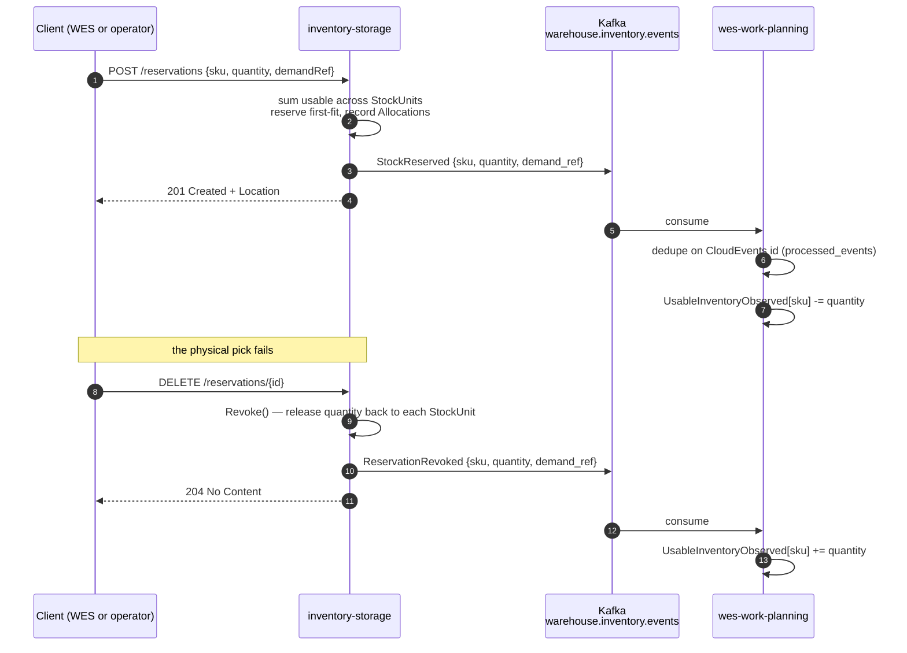

# Integration Guide

Everything a downstream team needs to consume this service, and everything an
operator needs to run it against the shared broker.

## What this service publishes

| | |
| --- | --- |
| **Topic** | `warehouse.inventory.events` |
| **Events** | `StockReserved`, `ReservationRevoked` |
| **Client library** | `github.com/segmentio/kafka-go` |
| **Balancer** | `Hash` (message key = reservation id, [ADR 0021](/docs/adr/0021-kafka-producer-partition-key)), `AllowAutoTopicCreation: true` |
| **Consumers today** | `wes-work-planning` |

## What this service consumes

Every state change to this service's own aggregates still arrives as an
explicit HTTP command against [the REST API](/docs/api-reference), which runs
this service's own invariants before anything is written.

**One Kafka topic, read into a local read model (ADR 0013).** `StowStock`
needs the target bin's zone attributes when the SKU being stowed carries the
`Hazmat` or `TemperatureSensitive` handling tag, to enforce placement rules
(hazmat-rated zone, matching temperature class — see
[ADR 0009](/docs/adr/0009-product-classification-as-sku-master-data) for the
fail-open/fail-closed asymmetry). With `LOCATION_LOOKUP_MODE=kafka` those
attributes come from `internal/adapters/outbound/facilitycache`, which
replays `facility-layout`'s `warehouse.facility.events` from the earliest
offset into memory on every start, under a unique per-process consumer group,
and blocks startup until the replay is complete (up to 60s). See
[ADR 0013](/docs/adr/0013-location-classification-via-facility-events).
Messages are CloudEvents 1.0; the consumer dispatches on these exact `type`
strings ([ADR-0024](../adr/0024-cloudevents-mandatory-envelope.md)):

- `com.warehouse.wms.facility-layout.zone.ZoneRegistered`
- `com.warehouse.wms.facility-layout.locationslot.LocationSlotRegistered`
- `com.warehouse.wms.facility-layout.locationslot.LocationSlotDecommissioned`

Any other type is ignored; a message that is not a valid CloudEvent (e.g. the
retired flat envelope) is dead-lettered to `warehouse.facility.events.dlq`
and the replay — and the readiness gate — moves past it.

| Env var | Default | Purpose |
| --- | --- | --- |
| `LOCATION_LOOKUP_MODE` | `permissive` | `kafka`: Kafka-fed local cache (what the `warehouse-infra` cluster runs). `http`: synchronous `GET /locations/{locationCode}/classification` on facility-layout per stow — the rollback for `kafka`. `permissive` (default): no lookup; every location reports `Known=false`, so placement rules never block a stow. |
| `FACILITY_LAYOUT_BASE_URL` | *(unset)* | Base URL for the `http` mode client, e.g. `http://facility-layout:80`. |
| `KAFKA_BROKERS` | *(unset)* | Required by `kafka` mode — startup fails if it is missing. |

## Configuration

| Env var | Default | Purpose |
| --- | --- | --- |
| `EVENT_PUBLISHER` | `log` | `kafka` swaps `ports.EventPublisher` for the Kafka adapters. With `DATABASE_URL` set, use cases write `outbox_events` rows inside their own transaction and a background relay in `cmd/inventory` drains them onto the topics (ADR 0017, `OUTBOX_RELAY_INTERVAL`, default `1s`); without a database the adapters publish directly. The default is `log` so tests and local runs need no broker. |
| `KAFKA_BROKERS` | `localhost:9092` | Comma-separated broker list |

There is one Kafka broker platform-wide: the in-cluster broker deployed by
`warehouse-infra`, whose external listener is published on the host at
`localhost:9092`. This repository's own `docker-compose.yml` deliberately
does **not** define a Kafka service.

```bash
# with the warehouse-infra kind cluster running
EVENT_PUBLISHER=kafka KAFKA_BROKERS=localhost:9092 go run ./cmd/inventory
```

## Message shapes

Every message is a CloudEvents 1.0 structured-mode event with the Kafka
header `content-type: application/cloudevents+json; charset=UTF-8`
([ADR-0024](../adr/0024-cloudevents-mandatory-envelope.md)); the full
attribute table is on the [Events page](/docs/api-reference/events). What
lands on the topic:

```json
{
  "specversion": "1.0",
  "id": "1f7a4c30-9b2d-4e85-a6c1-7d3f0b5e8a94",
  "source": "/warehouse/inventory-storage",
  "type": "com.warehouse.wms.inventory-storage.reservation.StockReserved",
  "subject": "res-1",
  "time": "2026-08-21T22:00:00Z",
  "datacontenttype": "application/json",
  "dataschema": "urn:warehouse:inventory-storage:events:StockReserved:v1",
  "data": { "sku": "SKU-1", "quantity": 5, "demand_ref": "order-42" }
}
```

```json
{
  "specversion": "1.0",
  "id": "4b9e2f61-7c3a-4d08-85e2-1a6f9c0d3b72",
  "source": "/warehouse/inventory-storage",
  "type": "com.warehouse.wms.inventory-storage.reservation.ReservationRevoked",
  "subject": "res-1",
  "time": "2026-08-21T22:10:00Z",
  "datacontenttype": "application/json",
  "dataschema": "urn:warehouse:inventory-storage:events:ReservationRevoked:v1",
  "data": { "sku": "SKU-1", "quantity": 5, "demand_ref": "order-42" }
}
```

Both carry the identical `data` shape, deliberately: the downstream projection
applies one to decrement and the other to increment the same counter.

## The downstream projection

`wes-work-planning` turns these two events into `UsableInventoryObserved`,
a read model **keyed by SKU** (package `internal/domain/inventoryview/`,
table `usable_inventory_view`, exposed at `GET /inventory-view/{sku}`).



Two design notes that a consumer must respect:

- **Keyed by SKU, not by path.** Inventory reservations are SKU-scoped;
  `wes-work-planning`'s own `CLAUDE.md` calls out explicitly that a path
  mapping must not be forced onto them because it does not exist.
- **Idempotency is mandatory.** Kafka delivery is at-least-once.
  `wes-work-planning` inserts each CloudEvents `id` into a `processed_events` table
  before applying the effect, and skips on a primary-key violation — without
  that, one redelivery double-decrements observed usable.

## Consuming this topic yourself

If you are building a sixth consumer:

1. **Read the spec, not this page.**
   [`apis/asyncapi.yaml`](https://github.com/IQVO/inventory-storage/blob/main/apis/asyncapi.yaml)
   is the contract and is Spectral-linted in CI.
2. **Only two events are on the integration topic** (`StockReserved`,
   `ReservationRevoked`). `warehouse.inventory.analytics` is internal to this
   service's analytics projector; do not build against it.
3. **Dispatch on the full `type` string; ignore unknown types.** The catalog
   grows. Reject (DLQ/skip) anything that is not a valid CloudEvent.
4. **Deduplicate on the CloudEvents `id`.** At-least-once.
5. **Ordering is per reservation only** (Kafka key = reservation id,
   `Hash` balancer — ADR-0021).
6. **Treat the events as a projection, not as truth.** For an authoritative
   answer, call `GET /inventory/{sku}/usable`. The event stream exists so
   consumers can keep a cheap local view warm, not so they can reimplement the
   ledger.

## Verifying end to end

The integration was smoke-tested for real against the shared broker, not just
unit-tested. To repeat it:

```bash
# 1. shared broker up: the warehouse-infra kind cluster, host port 9092

# 2. service up, publishing to Kafka
EVENT_PUBLISHER=kafka go run ./cmd/inventory &

# 3. seed a bin + stow, then reserve
curl -s -X POST localhost:8080/reservations \
  -H 'Content-Type: application/json' \
  -d '{"sku":"SKU-1","quantity":5,"demandRef":"order-42"}'

# 4. confirm it landed
kubectl --context kind-warehouse -n warehouse-systems exec -it kafka-controller-0 -c kafka -- \
  kafka-console-consumer.sh --bootstrap-server localhost:9092 \
  --topic warehouse.inventory.events --from-beginning
```

The unit-level equivalent lives in
`internal/adapters/outbound/kafka/golden_test.go`, which asserts the exact
CloudEvent JSON and `content-type` header the adapter produces against an in-memory `Writer` fake — no broker
required, which is why it runs in the default `go test ./...` suite.

## Deployment

The service ships as a container (`Dockerfile` at the repo root, published to
GHCR by the `docker-publish` CI job on `main`) and as a Helm chart
(`charts/inventory-storage`, linted by the `helm-lint` job). In the local
Kubernetes stack its REST API is reached through Kong at
`http://localhost:8000/api/inventory-storage`, and it runs inside the Istio
mesh for east-west traffic; `EVENT_PUBLISHER` and `KAFKA_BROKERS` are
ordinary chart values, while `LOCATION_LOOKUP_MODE=kafka` is injected by
`warehouse-infra` as extra env.
